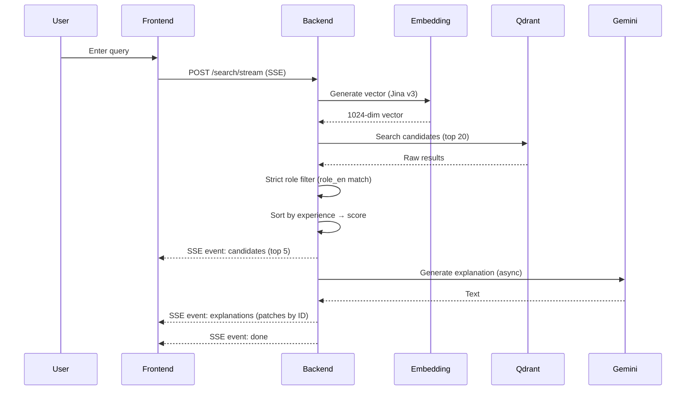
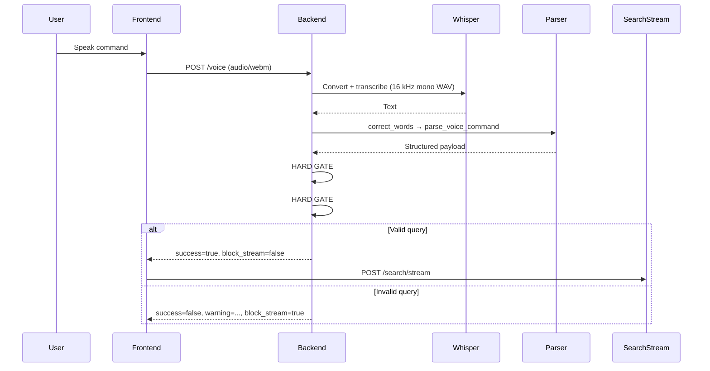

# API Documentation - Candidate Search API

## Base URL

```
http://localhost:8000/api/v1
```

---

## 1. Health Check

**GET** `/health`

Response:

```json
{ "status": "ok" }
```

---

## 2. Search API



### POST `/search/stream` (SSE — primary endpoint)

Streams results as Server-Sent Events. The frontend receives candidates immediately (~2–3 s), then AI explanations once Gemini finishes (~5–8 s).

**SSE Events emitted:**

| Event | When | Payload |
|---|---|---|
| `candidates` | After vector search | `{ query, results[] }` |
| `explanations` | After Gemini finishes | `{ patches: { [id]: explanation } }` |
| `done` | Stream complete | `{}` |
| `error` | Something went wrong | `{ detail: string }` |

Request body:

```json
{
  "query": "welder with ISO certification",
  "top_k": 5,
  "salary_range": { "min": 3000, "max": 6000 },
  "industry": "Teollisuus",
  "location_filter": 40,
  "role_keywords": ["welder", "welding"],
  "role_detected": true,
  "output_channel": "slack",
  "recipient_email": null
}
```

### POST `/search` (non-streaming fallback — N8N backward-compatible)

Returns the full response in a single JSON object. Used by N8N workflow automation.

Request body: same as `/search/stream`

Response:

```json
{
  "query": "welder with ISO certification",
  "results": [
    {
      "id": "...",
      "name": "...",
      "role_en": "welder",
      "experience_years": 8,
      "match_score": 91.4,
      "explanation": "AI-generated explanation...",
      ...
    }
  ]
}
```

### Ranking Logic

1. Retrieve up to 20 candidates from Qdrant
2. Apply **strict role filter**: results must match at least one `role_keywords` value against the `role_en` field — if none match, 0 results are returned (no fallback)
3. Sort by `experience_years` (primary) → `score` (secondary), descending
4. Return top `top_k` (default 5)

### Field Validators (SearchRequest)

- `salary_range`, `industry`, `location_filter`, `role_keywords`, `recipient_email`: `"null"` and `""` are normalized to `None`
- `output_channel`: defaults to `"slack"` if missing
- `role_keywords`: forced to empty list `[]` if `role_detected=True` but no keywords were provided (prevents silent fallback)

---

## 3. Voice API



### POST `/voice`

**Query params:**

| Param | Values | Required |
|---|---|---|
| `output_channel` | `slack` \| `email` | No (default: `slack`) |
| `recipient_email` | email string | Required if `output_channel=email` |

**Body:** `multipart/form-data` with field `audio` (audio/webm file)

**Hard gates (strict validation):**

- **Gate #1 — Role required:** If no `role_keywords` are detected, returns `success=false`, `block_stream=true`, and a warning. The frontend must NOT call the search endpoint.
- **Gate #2 — Industry required:** If no industry is resolved, same blocked response.

Response:

```json
{
  "success": true,
  "transcription": "Find welders within 40 km salary 3000 to 6000",
  "payload": {
    "query": "find welders within 40 km salary 3000 to 6000",
    "top_k": 5,
    "industry": "Teollisuus",
    "role_keywords": ["welder", "welding"],
    "role_detected": true,
    "salary_range": { "min": 3000, "max": 6000 },
    "location_filter": 40,
    "output_channel": "slack",
    "recipient_email": null
  },
  "warning": null,
  "block_stream": false,
  "processing_time": 1.84
}
```

Blocked response example:

```json
{
  "success": false,
  "transcription": "find someone good",
  "payload": { ... },
  "warning": "No role detected. Specify a job role like 'nurse', 'welder', 'driver', or 'software developer'.",
  "block_stream": true,
  "processing_time": 0.92
}
```

---

## 4. Voice Health

**GET** `/voice_health`

Response:

```json
{
  "status": "healthy",
  "whisper_model": "medium",
  "n8n_webhook": "https://..."
}
```

---

## 5. Supported Industries

| Industry (Finnish) | Triggered by keywords |
|---|---|
| Teollisuus | welder, welding, machinist, assembly worker, factory worker, production worker, cnc operator |
| Logistiikka | driver, truck driver, warehouse worker, forklift operator, logistics coordinator |
| HoReCa | chef, cook, waiter, bartender, kitchen assistant |
| Rakennusala | carpenter, electrician, plumber, construction worker, builder |
| ICT / Teknologia | software developer, backend/frontend/full stack developer, it engineer, devops engineer, programmer |
| Terveydenhuolto | doctor, physician, nurse, surgeon, paramedic, therapist |
| Turvallisuusala | security |
| Opetusala | teacher, education, training |

---

## 6. Error Codes

| Code | Meaning |
|---|---|
| 200 | Success |
| 400 | Bad request (e.g. non-audio file uploaded) |
| 404 | No candidates found |
| 422 | Validation error |
| 500 | Server error |
