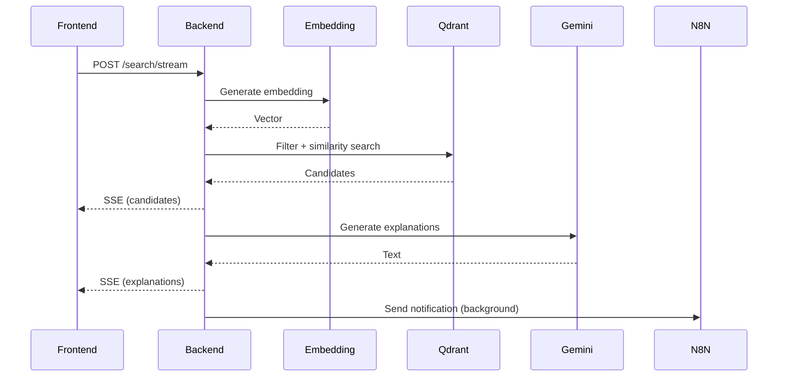
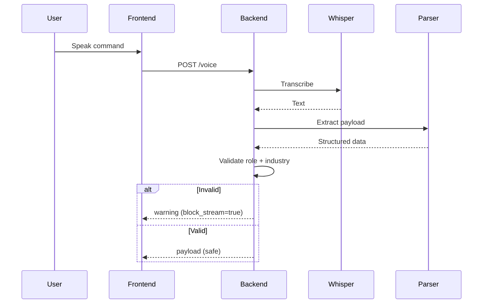

# API documentation - Candidate search API

## Base URL

http://localhost:8000/api/v1

---

## 1. Health check

GET /health

Response:

```json
{
  "status": "ok"
}
```

## 2. Streaming Search API (SSE)

Request

```json
{
  "query": "software developer",
  "top_k": 5,
  "salary_range": { "min": 3000, "max": 6000 },
  "industry": "ICT/Teknologia",
  "location_filter": 20,
  "role_keywords": ["developer", "engineer"],
  "role_detected": true,
  "output_channel": "slack",
  "recipient_email": null
}
```

**Validation rules (STRICT)**
industry is **required** → otherwise returns 0 results
**role_detected = true** but no **role_keywords** → forced empty match
No fallback behavior (e.g. doctor → nurses ❌)

**Streaming events (Server-sent events)**
**1. Candidates (instant)**

```
event: candidates
data:
{
  "results": [ ...candidate objects... ]
}
```

Top results returned immediately
Ranked by:
experience first
then by semantic similarity

**2. Explanations (async)**

```
event: explanations
data:
{
  "patches": {
    "candidate_id": "AI explanation text"
  }
}
```

Generated asynchronously (Gemini)
UI updates per candidate

**3. Error**

```
event: error
data:
{
"detail": "No doctor or physician found in the candidate collection"
}
```

### Search flow



## 3. Voice API (STRICT GATE)

This endpoint **does NOT trigger search**
It only validates and prepares payload for **/search/stream**

### POST /voice

### Query params

output_channel: slack | email
recipient_email: required if email

### Flow



** Hard validation gates**

1. Role required
2. Industry required

If either fails → request is blocked

### Response (Success)

```json
{
  "success": true,
  "transcription": "Find software developers within 20 km",
  "payload": {
    "query": "software developer",
    "industry": "ICT/Teknologia",
    "role_keywords": ["developer"],
    "role_detected": true
  },
  "processing_time": 1.2
}
```

### Response (Blocked)

```json
{
  "success": false,
  "transcription": "Find people",
  "payload": {},
  "warning": "No role detected. Please specify a job role like 'nurse', 'welder', 'driver', or 'software developer'.",
  "processing_time": 0.8,
  "block_stream": true
}
```

## 4. Voice health

GET /voice_health

```json
{
  "status": "healthy",
  "whisper_model": "base",
  "n8n_webhook": "configured_url"
}
```

## 5. Notification system (N8N)

- Triggered inside /search/stream
- Runs asynchronous background task
- Never blocks SSE response

Payload sent to N8N

```json
{
  "query": "software developer",
  "industry": "ICT/Teknologia",
  "salary_range": null,
  "location_filter": 20,
  "output_channel": "slack",
  "recipient_email": null,
  "results": [ ...candidates... ]
}
```

## 6. Supported industries

- Terveydenhuolto
- Logistiikka
- Rakennusala
- Teollisuus
- HoReCa
- Opetusala
- Puhtausala
- Turvallisuusala
- Kemia/Labra
- Satama-ala
- Ilmailu
- ICT/Teknologia

## 7. Error codes

| Code | Meaning                                |
| ---- | -------------------------------------- |
| 200  | Success                                |
| 400  | Invalid input (non-audio, bad request) |
| 422  | Validation error                       |
| 500  | Server error                           |

## 8. Key features

- Real-time SSE streaming (no waiting for full response)
- Strict role filtering (no irrelevant matches)
- Industry-based filtering (mandatory)
- Semantic search (Jina embeddings + Qdrant)
- AI explanations (Gemini)
- Background Slack/Email delivery (N8N)
- Voice-first UX with early validation (no wasted compute)
