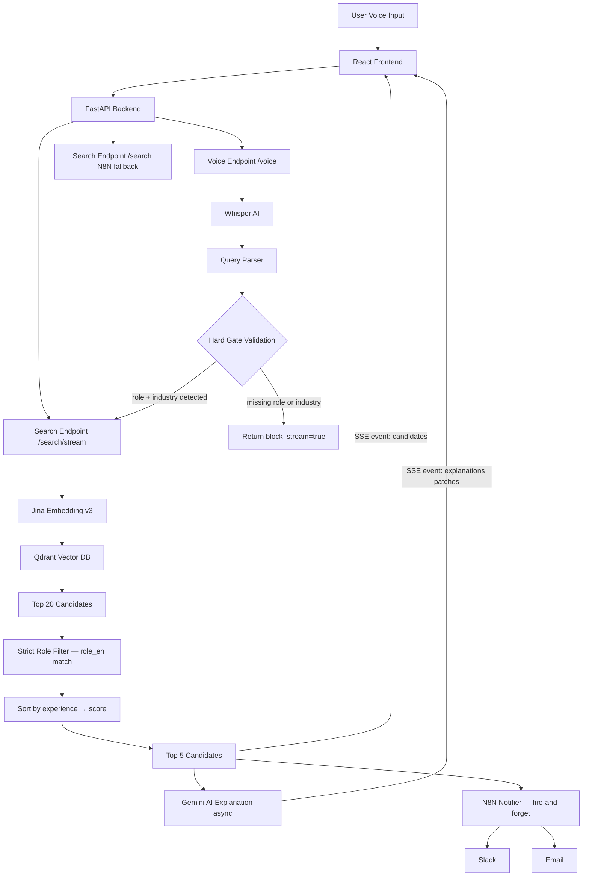
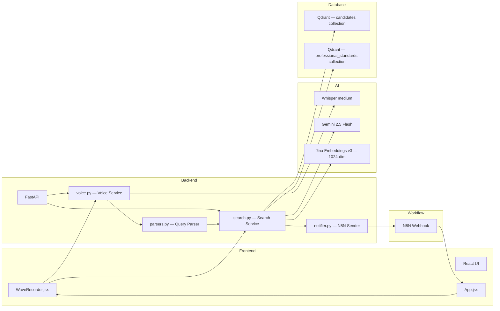
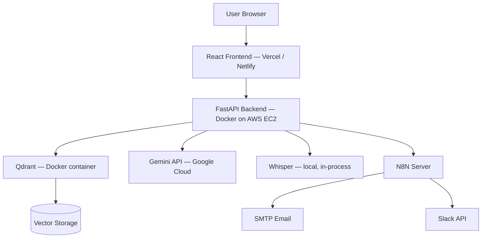

# System Architecture - Candidate Search API

## Overview

An AI-powered recruitment platform that enables voice-based candidate search with intelligent matching and automated result distribution via Slack or email.

---

## High-Level Architecture



---

## Component Breakdown



---

## Components

### 1. Frontend (React + MUI)

- `WaveRecorder.jsx`: captures audio (WebM/Opus at 16 kHz), sends to `/voice`, then opens SSE stream to `/search/stream`
- `App.jsx`: renders candidate cards with skeleton loaders while AI explanations stream in; provides Gmail compose link per candidate
- Distribution selector: Slack or Email (with recipient field)

### 2. Backend (FastAPI)

Handles all API requests, integrates AI services, and routes notifications.

| Endpoint | Description |
|---|---|
| `GET /api/v1/health` | Health check |
| `POST /api/v1/voice` | Audio transcription + validation |
| `GET /api/v1/voice_health` | Voice service health + config |
| `POST /api/v1/search/stream` | SSE streaming search (primary) |
| `POST /api/v1/search` | Non-streaming search (N8N backward-compat) |

### 3. Whisper AI (Speech-to-Text)

- Model: `medium` (configurable via `WHISPER_MODEL` env var)
- Model loaded once at server startup — no cold-start on subsequent requests
- Audio converted to 16 kHz mono WAV before transcription (supports WebM, MP3, FLAC, etc.)
- Supports English and Finnish
- Output post-processed through `correct_words()` for common ASR errors

### 4. Query Parser (`parsers.py`)

Extracts structured fields from raw transcription text:

| Field | Method |
|---|---|
| Industry | `INDUSTRY_ROLE_ONTOLOGY` phrase match (priority) → `INDUSTRY_MAP` keyword fallback |
| Role keywords | Ontology match across all industries + `ROLE_KEYWORD_MAP` expansion |
| Salary range | Regex: `(\d{3,5}) to (\d{3,5})` |
| Location radius | Regex: `(\d+) km` |
| Top-k | Regex: `top N`, `show N`, `find N` (default 5) |

Role and industry detection are cross-validated. If either is missing, the voice endpoint blocks the search pipeline (`block_stream=true`).

### 5. Qdrant Vector Database

- **candidates** collection: stores 1024-dim Jina embeddings for all candidate profiles
- **professional_standards** collection: stores industry benchmark profiles used to enrich queries
- Filters: industry (exact match), salary range, geo-radius (center: Lahti 60.9634°N, 25.6712°E)
- Query enrichment: standard's `min_education` and `mandatory_licenses` are appended to the raw query before embedding

### 6. Gemini AI (LLM)

- Model: `gemini-2.5-flash` (configurable; auto-fallback to `models/gemini-2.5-flash` on 404)
- Generates 4–5 sentence per-candidate match explanations referencing actual candidate data
- Handles quota errors (429) and model errors (404) gracefully — returns fallback message instead of crashing
- Runs concurrently with N8N notification via `asyncio` tasks

### 7. N8N Notifier (`notifier.py`)

- Fire-and-forget: runs as a background asyncio task, never delays the SSE stream
- Strict send conditions: skips if `industry`, `role_keywords`, or (for email) `recipient_email` are missing
- Forwards full candidate results payload to configured N8N webhook URL
- Uses a shared persistent `httpx.AsyncClient` for efficiency

---

## Data Flow

### Voice Search Flow

```
1. User speaks → WaveRecorder captures WebM audio
2. POST /voice → Whisper transcribes → correct_words() → parse_voice_command()
3. Hard Gate #1: role_detected required
4. Hard Gate #2: industry required
5. block_stream=false → frontend opens SSE to /search/stream
6. Vector search → role filter → sort → top 5
7. SSE: candidates event → UI renders cards
8. Gemini runs async → SSE: explanations event → UI patches cards
9. N8N notifier fires → Slack / Email delivery
```

### Text Search Flow (non-streaming)

```
1. POST /search with query + filters
2. Jina embedding → Qdrant search (limit 20)
3. Professional standard query enrichment
4. Strict role filter on role_en
5. Sort by experience → score
6. Gemini explanation (blocking)
7. Return top_k results
```

---

## Design Decisions

| Decision | Reason |
|---|---|
| SSE streaming over WebSockets | Simpler, HTTP-native; candidates appear in ~2 s while AI generates |
| Strict role filter (no fallback) | Prevents irrelevant results; mismatches return 0 rather than wrong candidates |
| Whisper loaded at startup | Eliminates 1–3 s cold-start penalty on first voice request |
| Experience-first ranking | More relevant for recruiters than pure similarity score |
| Fire-and-forget N8N | Notification never delays the user-facing SSE stream |
| Jina v3 (1024-dim) | Strong multilingual retrieval for Finnish industry roles |
| Gemini Flash | Fast + cost-efficient for explanation generation |
| Professional standard enrichment | Adds license/education context to raw query for better embedding |

---

## Limitations

- No authentication (development only)
- Whisper accuracy depends on microphone/audio quality
- Gemini subject to quota limits (graceful fallback message provided)
- Location geo-filter is currently fixed to Lahti coordinates (60.9634°N, 25.6712°E)
- Only mock candidate data for Finnish industry roles

---

## Future Improvements

- Real-time streaming transcription (replace Whisper batch with streaming STT)
- Authentication and user management
- Improved NLP parser (LLM-based intent extraction)
- AI response caching
- Configurable geo-filter center point (not hardcoded to Lahti)
- Multi-language support beyond English/Finnish

---

## Deployment Architecture (Planned)



All services communicate over internal Docker networking. External integrations (Gemini, Slack, SMTP) are reached via the public internet.
