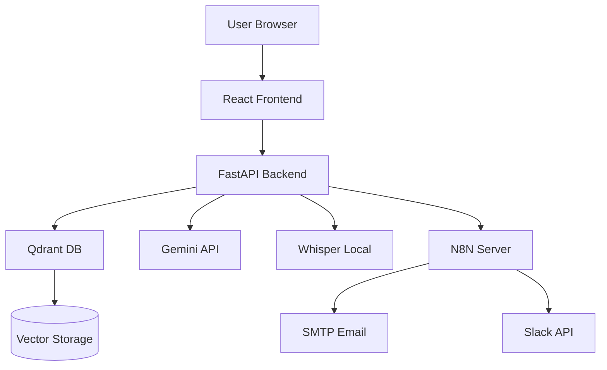

# System architecture - Candidate voice search

## Overview

This system is an AI-driven recruitment platform that supports **voice-based candidate search with real-time streaming output, strict input validation, and automated result delivery.**

## High-level architecture

```mermaid
flowchart TD
    A[User Voice Input] --> B[React Frontend]

    B --> C[/voice Endpoint]

    C --> D[Whisper Transcription]
    D --> E[Query Parser]

    E --> F{Validation Gate}

    F -- Invalid --> G[Return Warning<br/>Block Search]
    F -- Valid --> H[/search/stream]

    H --> I[Jina Embedding]
    I --> J[Qdrant Vector DB]

    J --> K[Filtered Candidates]

    K --> L[SSE: Candidates Stream]

    K --> M[Gemini AI]
    M --> N[SSE: Explanations Stream]

    K --> O[N8N Background Task]

    O --> P1[Slack]
    O --> P2[Email]

    L --> B
    N --> B
```

## Components

```mermaid
flowchart LR
subgraph Frontend
A1[React UI + WaveRecorder]
end

subgraph Backend
B1[FastAPI]
B2[/voice Endpoint]
B3[/search/stream Endpoint]
B4[Parser + Validation]
B5[Notifier (N8N)]
end

subgraph AI
C1[Whisper]
C2[Gemini Flash]
C3[Jina Embeddings v3]
end

subgraph Database
D1[Qdrant Vector DB]
end

A1 --> B1
B1 --> B2
B1 --> B3

B2 --> C1
B2 --> B4

B3 --> C3
B3 --> D1
B3 --> C2
B3 --> B5
```

### 1. Frontend (React)

- Voice input captured using WaveRecorder
- Two-stage streaming interface:
  - Immediate candidate results
  - Asynchronous AI-generated explanations
- Centralised error handling with a single warning source
- Channel selection for Slack or Email distribution

### 2. Backend (FastAPI)

- Handles API requests
- Processes voice input
- Integrates AI services

#### Endpoints:

- /api/v1/voice (strict validation only)
- /api/v1/search/stream (SSE streaming search)
- /api/v1/health
- /api/v1/voice_health

### 3. Voice Processing (STRICT GATE)

#### Flow

1. Audio upload
2. Whisper → transcription
3. Parser → structured payload
4. Validation:
   - role required
   - industry required
5. If invalid → blocked immediately
6. If valid → frontend calls /search/stream

Key behavior

- Prevents wasted compute (no Qdrant / Gemini if invalid)
- Returns warning + block_stream

### 4. Search engine (Streaming)

#### Endpoint: /search/stream

#### Flow

1. Query embedding (Jina v3)
2. Qdrant similarity search (filtered by industry)
3. Post-filter by role_keywords (STRICT)
4. Return candidates immediately (SSE)
5. Generate explanations asynchronously (Gemini)
6. Stream explanation patches (SSE)
7. Trigger N8N in background

Key improvements

- No full-response blocking
- No fallback role matching
- No silent failures

### 5. Whisper AI (Speech-to-Text)

- Converts voice → text
- Supports English & Finnish
- Model: `medium`

### 6. Query parser

Extracts:

- Industry
- Salary range
- Location radius
- Top_k

### 7. Jina embeddings v3

- Generates dense vector embeddings for semantic search
- Used in /search/stream before querying Qdrant
- Model loaded once (singleton) for performance

### 8. Qdrant vector database

- Stores candidate embeddings (1024-dim)
- Also stores professional standards collection
- Used to enrich queries with:
  - education
  - licenses
- Performs similarity search

Filtering

- Industry (mandatory)
- Salary range (optional)
- Geo radius (optional)
- Role keywords (post-filter)

### 9. Gemini AI (LLM)

- Model: `gemini-2.5-flash`
- Generates candidate match explanations
- Runs after candidates are shown
- Streams results incrementally

### 10. N8N workflow

- Triggered inside /search/stream
- Runs async (fire-and-forget)
- Never blocks UI
- Automates:
  - API chaining
  - Email sending
  - Slack messaging

### Data flow

#### Voice flow

1. User speaks
2. /voice endpoint
3. Whisper → text
4. Parser → payload
5. Validation gate:
   - fail → return warning
   - pass → continue
6. Frontend calls /search/stream

#### Search flow

1. Query received
2. Query enriched with professional standards
3. Embedded using Jina v3
4. Qdrant search (filtered by industry)
5. Role keyword strict filtering
6. SSE → candidates
7. Gemini → explanations

#### Streaming model (NEW)

| Phase   | Description                    |
| ------- | ------------------------------ |
| Phase 1 | Candidates returned instantly  |
| Phase 2 | AI explanations streamed later |

#### Design decisions

| Decision                 | Reason                         |
| ------------------------ | ------------------------------ |
| SSE streaming            | Instant UX, no waiting         |
| Strict role filtering    | Prevent irrelevant matches     |
| Industry required        | Avoid empty / noisy results    |
| Background N8N           | Non-blocking notifications     |
| Two-phase response       | Faster perceived performance   |
| Early voice validation   | Save compute cost              |
| Jina v3 embeddings       | High-quality semantic matching |
| Qdrant                   | Fast vector similarity search  |
| Whisper local            | Free, no API cost              |
| Gemini Flash             | Fast + cost-efficient          |
| N8N                      | No-code workflow automation    |
| Experience-first ranking | Better recruiter relevance     |

#### Limitations (current)

- Seniority not parsed (e.g. “senior developer”)
- Location center fixed (Lahti)
- Role keyword mapping incomplete (e.g. welder gaps)
- No authentication
- Synthetic dataset
- Whisper accuracy depends on audio quality
- Gemini quota limits

#### Future improvements

- Dynamic geo-location filtering
- Better role ontology (seniority support)
- Real-time streaming transcription
- Auth + user sessions
- Smarter ranking (beyond experience)
- Caching embeddings & results
- Better NLP parser

## Deployment architecture (planned)

This architecture ensures scalability, modularity, and separation of concerns.


