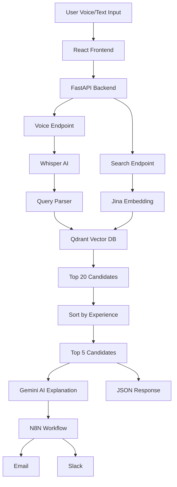
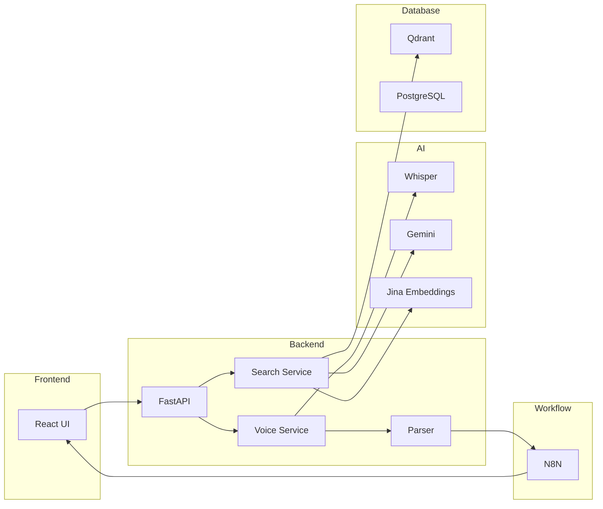
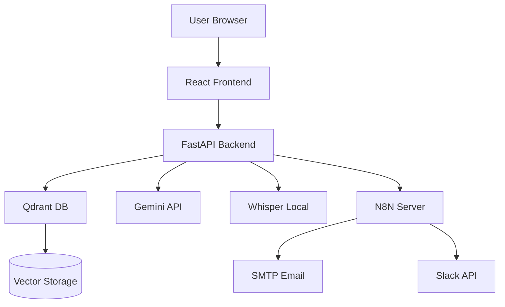

# System architecture - Candidate search API

## Overview

This system is an AI-powered recruitment platform that enables voice-based candidate search with intelligent matching and automated result distribution.

## High-level architecture

## Components

### 1. Frontend (React)

- Voice recording (WebM)
- API communication
- Results visualization

### 2. Backend (FastAPI)

- Handles API requests
- Processes voice input
- Integrates AI services

Endpoints:

- `/api/v1/voice`
- `/api/v1/search`
- `/api/v1/health`
- `/api/v1/voice_health`

---

### 3. Whisper AI (Speech-to-Text)

- Converts voice → text
- Supports English & Finnish
- Model: `medium`

---

### 4. Query parser

Extracts:

- Industry
- Salary range
- Location radius
- Top_k

---

### 5. Qdrant vector database

- Stores candidate embeddings (1024-dim)
- Performs similarity search

---

### 6. Gemini AI (LLM)

- Model: `gemini-2.5-flash`
- Generates candidate match explanations

---

### 7. N8N workflow

- Automates:
  - API chaining
  - Email sending
  - Slack messaging

---

## Data flow

### Voice flow

1. User speaks
2. Audio → `/voice`
3. Whisper → text
4. Parser → structured query
5. N8N webhook triggered
6. `/search` API called
7. Results sent via Email/Slack

---

### Search flow

1. Query received
2. Embedded (Jina v3)
3. Qdrant search (top 20)
4. Sorted by:
   - Experience (primary)
   - Match score (secondary)
5. Top 5 returned
6. Gemini generates explanations

---

## Design decisions

| Decision                 | Reason                        |
| ------------------------ | ----------------------------- |
| Qdrant                   | Fast vector similarity search |
| Whisper local            | Free, no API cost             |
| Gemini Flash             | Fast + cost-efficient         |
| N8N                      | No-code workflow automation   |
| Experience-first ranking | Better recruiter relevance    |

---

## Limitations

- No authentication
- Whisper accuracy depends on audio quality
- Gemini quota limits

---

## Future improvements

- Real-time streaming transcription
- Authentication system
- Better NLP parser
- Caching AI responses

## Deployment architecture (Planned)

- Frontend hosted on Vercel or Netlify
- Backend deployed via Docker (e.g., AWS EC2)
- Qdrant hosted in Docker container
- N8N running as workflow service
- External integrations: Gemini API, Slack API, SMTP

This architecture ensures scalability, modularity, and separation of concerns.

