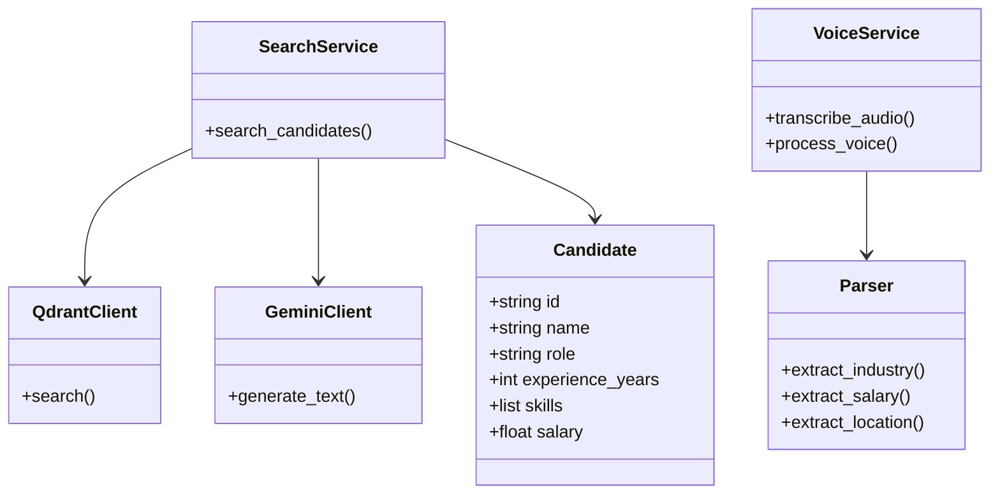
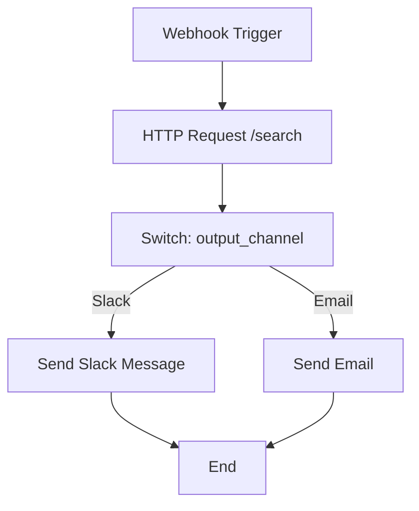

## UML class diagram (Backend)

```mermaid
classDiagram

class Candidate {
+string id
+string name
+string role
+int experience_years
+list skills
+float salary
}

class SearchService {
+search_candidates()
}

class VoiceService {
+transcribe_audio()
+process_voice()
}

class Parser {
+extract_industry()
+extract_salary()
+extract_location()
}

class GeminiClient {
+generate_text()
}

class QdrantClient {
+search()
}

VoiceService --> Parser
SearchService --> QdrantClient
SearchService --> GeminiClient
SearchService --> Candidate
```

## N8N workflow diagram

```mermaid
flowchart TD
A[Webhook Trigger] --> B[HTTP Request /search]

    B --> C[Switch: output_channel]

    C -->|Slack| D[Send Slack Message]
    C -->|Email| E[Send Email]

    D --> F[End]
    E --> F[End]
```
