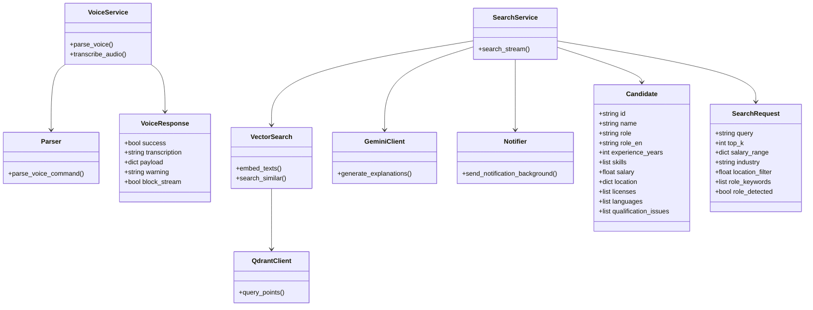

## UML class diagram (Backend)



## N8N workflow diagram

```mermaid
flowchart TD
A[FastAPI /search/stream] --> B[Notifier (async)]

B --> C[POST → N8N Webhook]

C --> D[Switch: output_channel]

D -->|Slack| E[Send Slack Message]
D -->|Email| F[Send Email]

E --> G[End]
F --> G[End]
```
