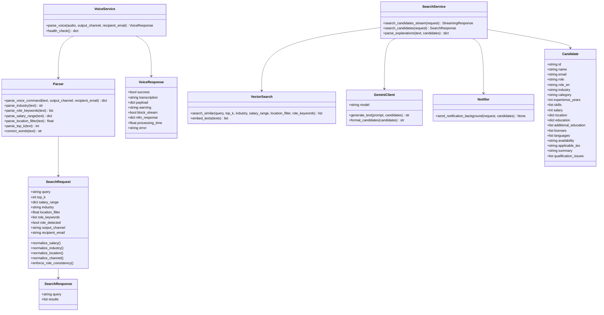
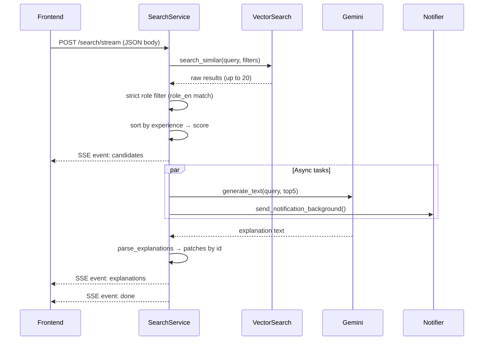
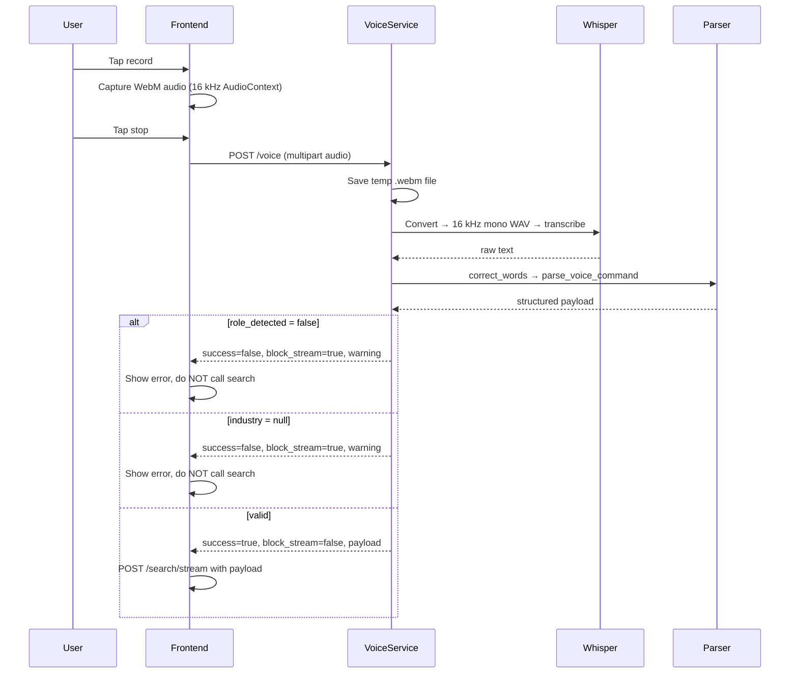
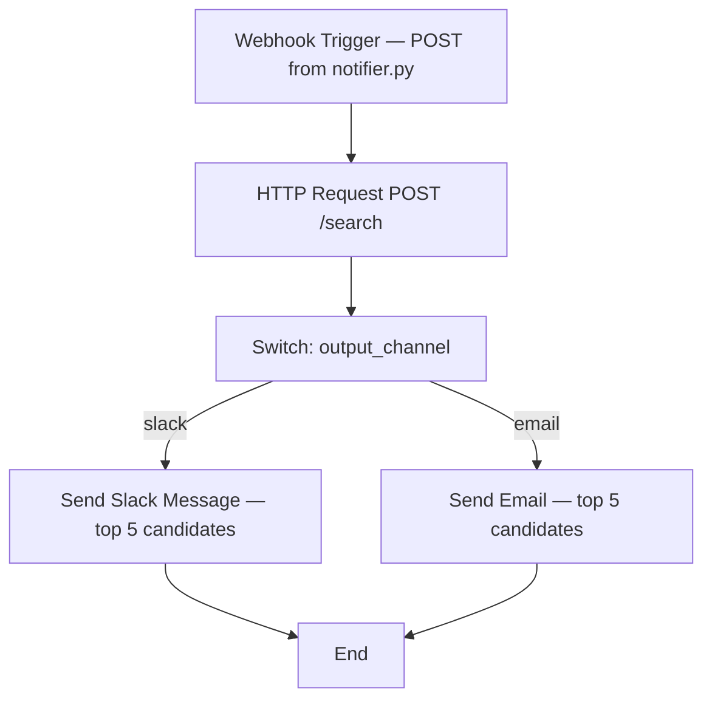
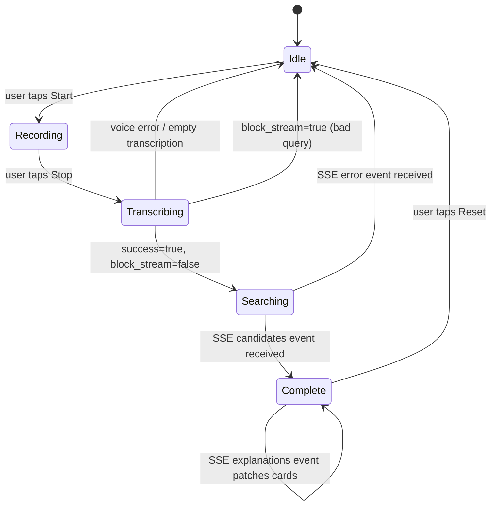

# UML Diagrams

## UML Class Diagram (Backend)

---

## Sequence Diagram — Streaming Search (SSE)

---

## Sequence Diagram — Voice Pipeline

---

## N8N Workflow Diagram

**N8N send conditions (enforced in notifier.py):**
- `industry` must be present
- `role_keywords` must be present
- If `output_channel=email`, `recipient_email` must be provided
- Results list must not be empty
- `N8N_WEBHOOK_URL` must be configured

---

## State Diagram — Frontend Search Session

