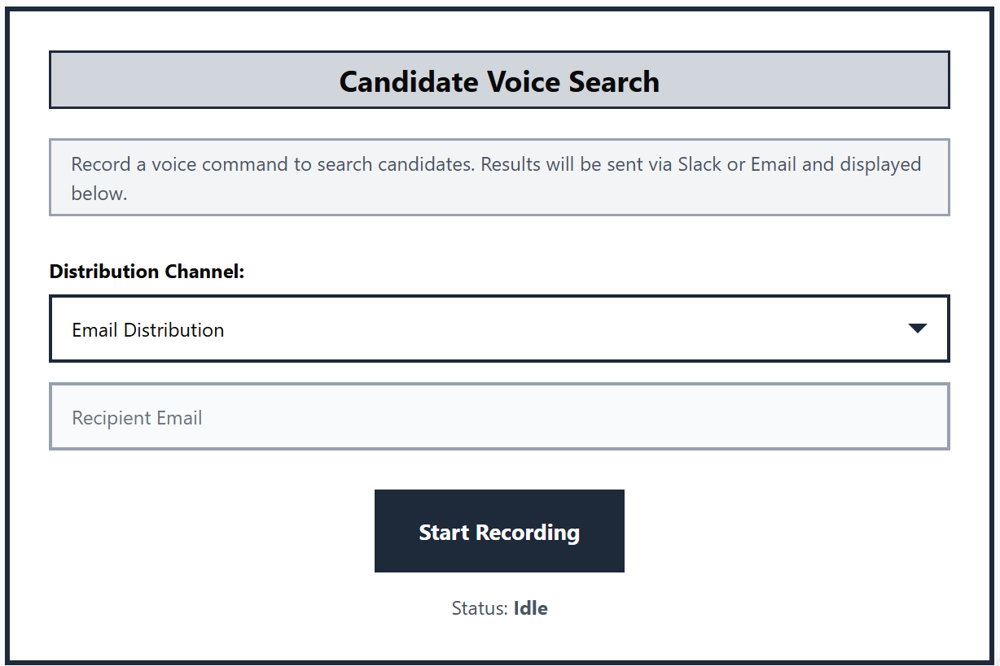
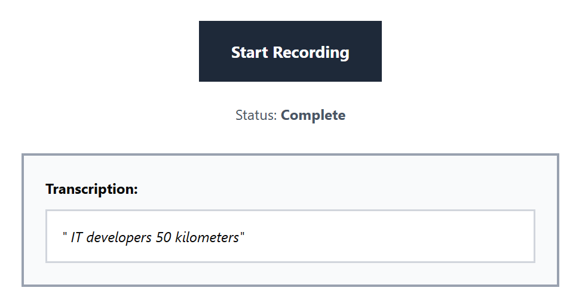

## Project overview

**Application**: Candidate voice search system
**Purpose**: allow recruiters to search and evaluate candidates via voice commands, with results distributed through Slack or email, and displayed on an interactive dashboard.

**Key features**:

- Voice recording and transcription using WaveRecorder
- Candidate search results displayed in interactive cards
- AI-generated match explanations
- Multi-channel output: Slack / Email
- Interactive Gmail invitation composition
- Rich candidate details: skills, licenses, languages, education, experience, salary, availability

## Wireframes

### Home / Voice search screen

Centered recorder, status display, distribution selector, email input field.

### Transcription display

Transcription appears below the recorder once a voice command is processed.

### Candidate result card

[Candidate card](candidate_card_wireframe.png)
Card layout with experience, match score, skills, licenses, languages, and Gmail invitation button.

## Mockups

### Home screen mockup

Recorder, distribution selector, and step status display.

### Candidate results mockup

[Candidate results](/mnt/data/candidate_results_mockup.png)
Top candidates displayed as interactive cards with hover effects and actionable buttons.

### Color palette:

- Primary: #0077B6 (Blue)
- Secondary: #F59E0B (Yellow)
- Success / Qualification OK: #28a745
- Alert / Qualification Issue: #ffc107
- Background: #F3F4F6

### Typography:

- Headings: Inter Bold
- Body: Inter Regular

### Interaction notes:

- Record button animates while recording
- Candidate cards elevate on hover
- Skills displayed as chips
- Gmail button triggers external email composition
- Reset button allows starting a new search

## Design methods applied

1. Kano model classification:
   | Feature | Classification | Notes |
   | ------------------------- | -------------- | ------------------------------------- |
   | Voice recording | Basic | Users expect this as default |
   | AI match scores | Performance | Higher accuracy improves satisfaction |
   | AI-generated explanations | Excitement | Delight users and adds value |

2. Five-second impression evaluation:

- Users should identify the main function (voice search) and see top candidate cards within 5 seconds.
- Insight: centered recorder and clear candidate card headers meet this criterion.

3. Customer journey mapping:

**Stages**:

1. Open app → sees voice recorder
2. Record command → transcription displayed
3. Results generated → candidate cards populated
4. Select candidate → send Gmail invitation
5. Reset → start new search

**Touchpoints**: Voice recorder, transcription display, candidate cards, Gmail integration, reset workflow.

4. Focus group insights:
   5 recruiters tested the app:
   - Prefer Slack/email selection upfront
   - Gmail button should clarify “Send Interview Invitation”
   - Candidate cards should visually distinguish critical alerts (qualification issues)
5. Cognitive walkthrough:
   Step-by-step evaluation of discoverability, feedback, and user guidance:
   - Record → transcription → candidate selection → invitation sent
     Outcome: All critical actions visible and intuitive; hover cues improved.
6. Attention-oriented review:
   Eye-tracking simulations / visual hierarchy:
   - Primary attention: Recorder and status
   - Secondary attention: Top candidate cards
   - Tertiary attention: Skills, qualifications, email button
     Adjustment: Status and Gmail button visually emphasized to guide attention.

## UI/UX principles applied

- Consistency: color, typography, and card layout uniform.
- Feedback: step and loading status clearly visible.
- Affordance: buttons and cards clearly indicate interactivity.
- Accessibility: text contrasts, clear fonts, visual alerts.
- Responsiveness: works on multiple screen sizes, grid layout adjusts.

## Next steps

- Add voice command validation tips
- Include tooltip for AI match explanations
- Implement mobile-specific layout
- Conduct usability testing with a broader recruiter audience
